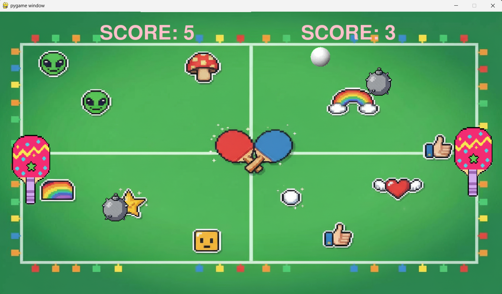

# Pong-Py: Аркадная игра "Пинг-Понг" на Python



## Описание
Это мой учебный проект — классическая аркада "Пинг-Понг"! Я студент 1 курса специальности "Программная инженерия". У нас была задачу сделать мини-игру. Я добавил авторский дизайн и звуковое сопровождение. В планахи по улучшениям: переработка физики мяча, создание пользовательского интерфейса(с возможностью выбора темы игры), создание истории игр, исправление бага с ракеткой, добавление паузы и Game Over.

**Буду рад фидбеку и идеям для новых фич — пишите свои предложения!**
Код содержит комментарии о будущем добавлении меню, режима паузы и Game Over.

---

## Возможности
- 🎇 Анимация взрыва при столкновении с миной
- 🎵 Звуковое сопровождение (разные эффекты)
- 👥 Режим двух игроков на одной клавиатуре
- 🚀 Простая и быстрая установка — просто запусти!
- 🖌️ Авторский дизайн, кастомные спрайты

---

## Установка
1. Клонируй репозиторий:
    ```
    git clone https://github.com/vladosss-prog/PingPongByPython.git
    cd PingPongByPython
    ```
2. Установи зависимости (если потребуется):
    ```
    pip install pygame
    ```
3. Запусти игру:
    ```
    python main.py
    ```

---

## Управление
- **Q** — выход из игры
- **W/S** — вверх/вниз (Player 1)
- **↑/↓** — вверх/вниз (Player 2)
- **P** — пауза *(в планах)*

---

## Скриншоты
Чуть потом)

